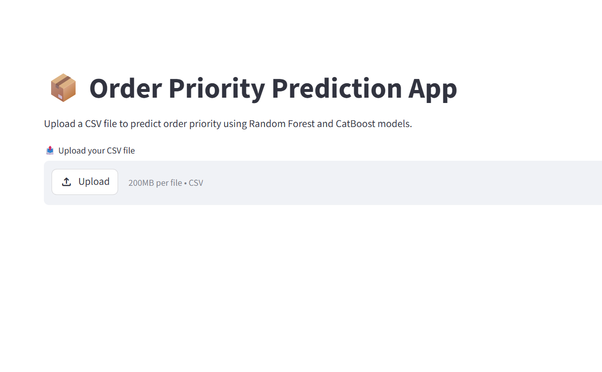
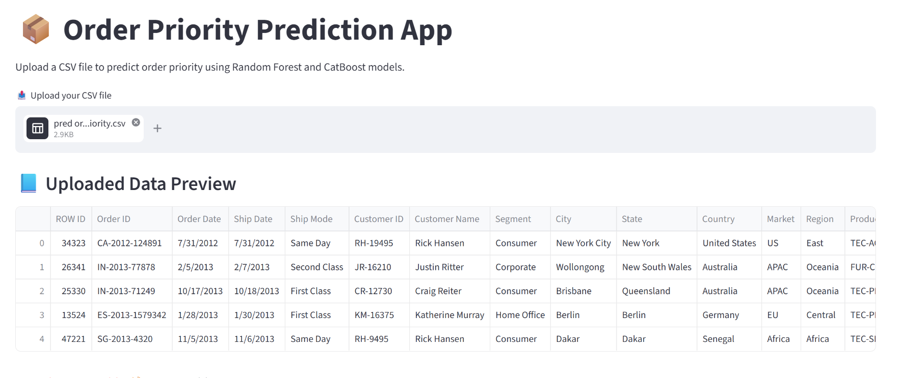
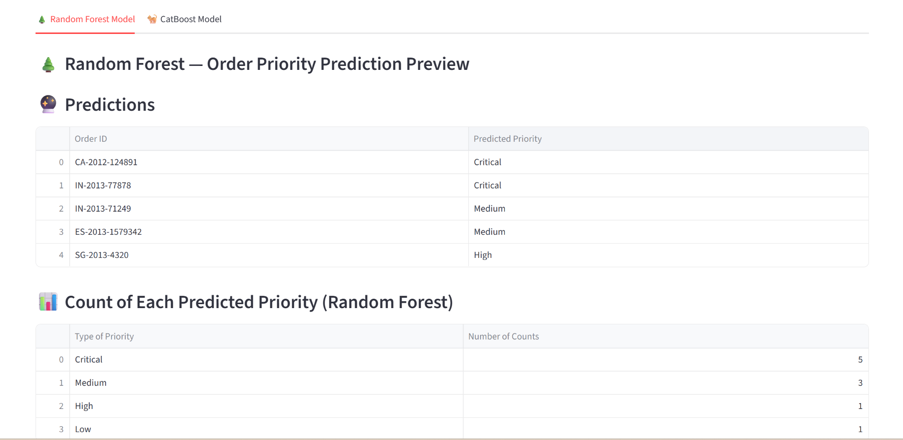
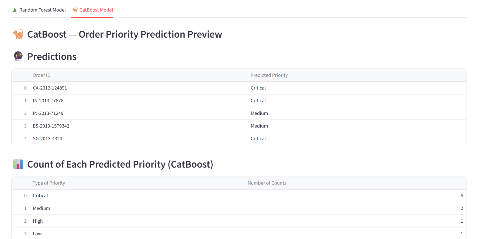
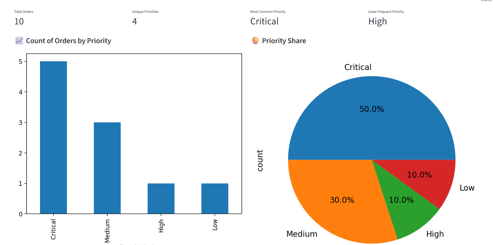
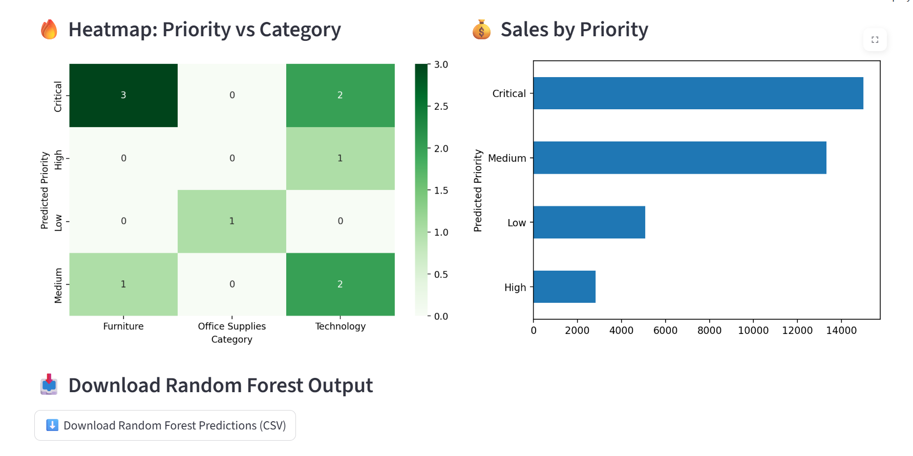

<h1>📦 Order Priority Prediction App</h1>

<h2>Overview</h2>

This project is a Machine Learning-powered web application built using Streamlit that predicts
<strong>Order Priority</strong> from e-commerce order data. The application allows users to upload a CSV file,
generate predictions using both Random Forest and CatBoost models, compare results, visualize insights
through interactive dashboards, and download prediction outputs.

<h2>Problem Statement</h2>

Businesses process thousands of customer orders every day, making it difficult to manually assign the correct order priority. Incorrect prioritization can lead to delayed deliveries, inefficient resource allocation, and reduced customer satisfaction. An automated solution is needed to accurately predict order priority based on historical order data.

<h2>Solution</h2>

This project provides a Machine Learning-based solution that predicts order priority using Random Forest and CatBoost models. Built with Streamlit, the application allows users to upload order data, generate predictions, visualize insights through interactive dashboards, compare model outputs, and download prediction results for further analysis.

<h2>Features</h2>

<h3>🌲 Random Forest Model</h3>
<ul>
    <li>A supervised ensemble learning algorithm that combines multiple decision trees to improve prediction accuracy and reduce overfitting.</li>
    <li>Predicts Order Priority from uploaded order data</li>
    <li>Displays prediction results</li>
    <li>Interactive dashboard with KPIs and visualizations</li>
    <li>Download predictions as CSV</li>
</ul>

<h3>🐈 CatBoost Model</h3>
<ul>
    <li>A gradient boosting algorithm that handles categorical features efficiently and often provides strong performance on structured datasets.</li>
    <li>Predicts Order Priority using CatBoost</li>
    <li>Displays prediction results</li>
    <li>Interactive dashboard with KPIs and visualizations</li>
    <li>Download predictions as CSV</li>
</ul>

<h2>📊 Dashboard Analytics</h2>

<h3>Key Performance Indicators (KPIs)</h3>
<ul>
    <li>Total Orders</li>
    <li>Unique Priority Levels</li>
    <li>Most Common Priority</li>
    <li>Least Frequent Priority</li>
</ul>

<h3>Visualizations</h3>
<ul>
    <li>Count of Orders by Priority (Bar Chart)</li>
    <li>Priority Distribution (Pie Chart)</li>
    <li>Priority vs Category Heatmap</li>
    <li>Sales vs Priority (Horizontal Bar Chart)</li>
    <li>Priority Count Summary Table</li>
</ul>

<h2>Technologies Used</h2>

<ul>
    <li>Python</li>
    <li>Streamlit</li>
    <li>Pandas</li>
    <li>NumPy</li>
    <li>Matplotlib</li>
    <li>Seaborn</li>
    <li>Scikit-learn</li>
    <li>Random Forest Classifier</li>
    <li>CatBoost</li>
</ul>

<h2>Project Structure</h2>

<pre>
├── cat_cols.joblib
├── e-commerce
├── order_priority_feature_encoders.pkl
├── order_priority_model.cbm
├── order_priority_prediction_catboost
├── order_priority_prediction_random_forest
├── order_priority_target_encoder.pkl
├── orderpriority_randomforest.pkl
├── pred order priority
├── rf_catboost.py
└── rf_feature_columns.pkl
</pre>

<h2>Instructions for Running the Model</h2>

<ol>
    <li>
        Download <strong>orderpriority_randomforest.pkl</strong> from the Google Drive link below:
         
        <a href="https://drive.google.com/drive/folders/1truJ6yMuA5KKVZldqTCEmxBHxmGmLSex?usp=drive_link">
            Google Drive Download Link
        </a>
    </li>

<li>
        Download the remaining files from the GitHub repository:
         
        <a href="https://github.com/jayant-kadam/order-priority-prediction">
            GitHub Repository
        </a>
</li>

<li>Create a project folder and copy all downloaded files into it.</li>

<li>Run the <strong>rf_catboost.py</strong> file using your preferred IDE.</li>

<li>
        Upload the <strong>pred order priority</strong> CSV file and the model will predict
        Order Priority and generate an interactive dashboard.
</li>

<li>Input data must be provided in <strong>.csv</strong> format.</li>

<li>
        The input CSV file must contain the following columns:
        <pre>
ROW ID
Order ID
Order Date
Ship Date
Ship Mode
Customer ID
Customer Name
Segment
City
State
Country
Market
Region
Product ID
Category
Sub-Category
Product Name
Sales
Quantity
Discount
Shipping Cost
Profit
Order Year
Order Month
Order Day
Ship Year
Ship Month
Ship Day
Delivery Time
Cost
        </pre>
</li>
</ol>

<h2>Future Enhancements</h2>

<ul>
    <li>Feature Importance Visualization</li>
    <li>Model Performance Comparison</li>
    <li>Prediction Confidence Scores</li>
    <li>Cloud Deployment</li>
    <li>Additional Machine Learning Models</li>
    <li>Advanced Filtering and Reporting</li>
</ul>

<h2>Prreview</h2>

<h3>Home Page</h3>

  

<h3>Input Data Preview</h3>

  

<h3>Random Forest Prediction Preview</h3>

  

<h3>CatBoost Prediction Preview</h3>

  

<h3>KPIs and Dashboard</h3>

  

<h3>Dashboard and Download Predictions Button</h3>

  

<h2>Author</h2>

<strong>Jayant Kadam</strong> 
Data Analyst 
https://www.linkedin.com/in/jayantkadam/

